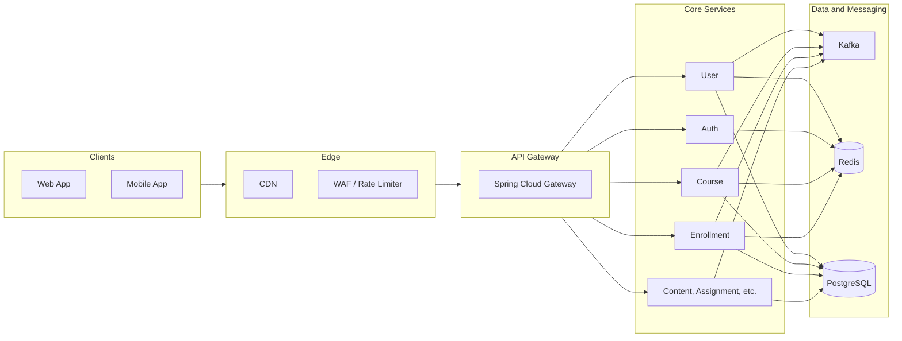
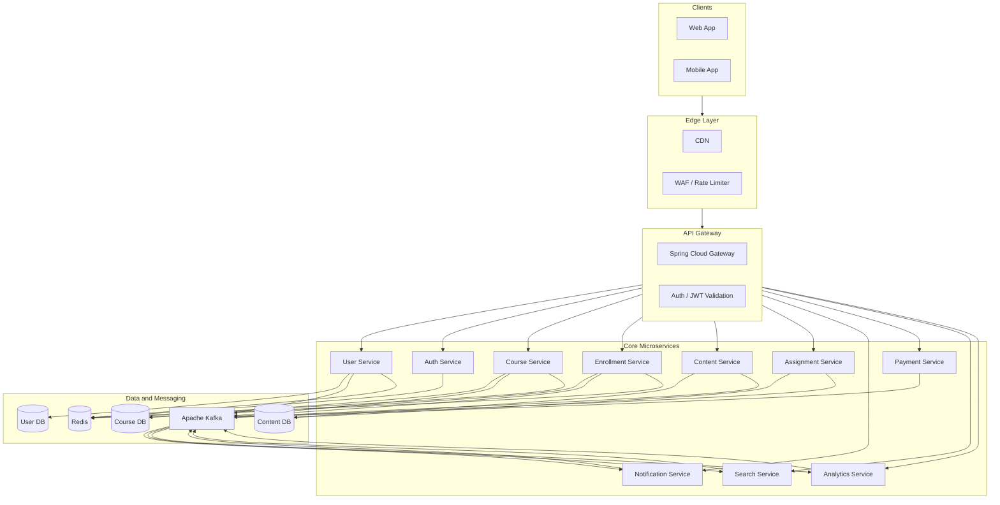

# 1. High-Level Architecture

## System Context

Requests flow from clients through an edge layer and a single API Gateway into microservices. Services use REST for user-facing operations and Kafka for cross-cutting concerns (notifications, search indexing, analytics). Each service owns its data store; Redis is used for sessions, cache, and distributed coordination.

## Component Diagram

## Design Principles

| Principle | Description |
|-----------|-------------|
| **Single entry** | All client traffic enters via the API Gateway. No direct access to backend services from the internet. |
| **Sync for user actions** | Login, enroll, submit assignment, get course, get progress: use REST for immediate response and clear success/failure. |
| **Async for cross-cutting** | Search indexing, notifications, analytics: use Kafka so producers stay decoupled and multiple consumers can subscribe. |
| **Database per service** | Each service owns its schema (or database). No shared DB access across services; integrate via APIs and events. |
| **Redis for shared state** | Sessions, JWT blacklist, refresh tokens, rate limits, cache, and distributed locks use Redis (optionally Redis Cluster for HA). |

## Data Flow Summary

- **Request path:** Client → Edge (CDN/WAF) → Gateway (auth, rate limit, route) → Target service → DB / Redis / Kafka as needed.
- **Response path:** Service → Gateway → Client.
- **Event path:** Service publishes to Kafka → Consumers (Notification, Search, Analytics) process asynchronously.

See [02-microservices.md](02-microservices.md) for service responsibilities and [03-api-gateway.md](03-api-gateway.md) for routing and security at the gateway.
