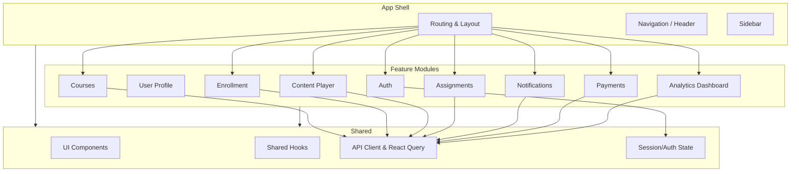

# 1. Frontend High-Level Architecture

## System Context

The LMS frontend is a **single-page application (SPA)** running in the browser. It communicates only with the **API Gateway** over HTTPS; the gateway then routes to backend microservices.

```mermaid
flowchart LR
    subgraph client [Client]
        WebApp[React SPA (Vite)]
    end

    subgraph edge [Edge]
        CDN[CDN]
        WAF[WAF / Rate Limiter]
    end

    subgraph gateway [API Gateway]
        GW[Spring Cloud Gateway]
    end

    subgraph backend [Backend Services]
        UserSvc[User]
        AuthSvc[Auth]
        CourseSvc[Course]
        EnrollSvc[Enrollment]
        ContentSvc[Content]
        AssignSvc[Assignment]
        NotifSvc[Notification]
        PaymentSvc[Payment]
        AnalyticsSvc[Analytics]
    end

    WebApp --> edge --> GW
    GW --> UserSvc
    GW --> AuthSvc
    GW --> CourseSvc
    GW --> EnrollSvc
    GW --> ContentSvc
    GW --> AssignSvc
    GW --> NotifSvc
    GW --> PaymentSvc
    GW --> AnalyticsSvc
```

## Frontend Modules

The SPA is organized into **feature modules** and **shared infrastructure**:



## Design Principles

| Principle | Description |
|----------|-------------|
| **Single backend entry** | All HTTP calls go through the API Gateway base URL (e.g. `/api/v1/**`). No direct calls to individual services. |
| **Feature-first structure** | Group code by domain feature (`features/courses`, `features/auth`) rather than by technical type. |
| **Separation of concerns** | UI components focus on rendering; data fetching and mutations live in hooks powered by React Query; routing/layout in a dedicated app layer. |
| **Route-based code splitting** | Split bundles per top-level route (auth, learner area, instructor area) to keep initial load small. |
| **Optimistic UX when safe** | Use optimistic updates for non-critical flows (e.g. marking notification as read), but avoid for payments/auth. |
| **Accessibility and responsiveness** | All screens must be keyboard-accessible and responsive from mobile to desktop. |

## Mapping to Backend Services

- **Auth / session** → `/api/v1/auth/**` and `/api/v1/users/**` from backend Auth and User services.
- **Courses & content** → `/api/v1/courses/**`, `/api/v1/content/**` from Course and Content services.
- **Enrollment & progress** → `/api/v1/enrollments/**`.
- **Assignments** → `/api/v1/assignments/**`.
- **Notifications** → `/api/v1/notifications/**`.
- **Payments** → `/api/v1/payments/**`.
- **Analytics** → `/api/v1/analytics/**`.

Versioning and deprecations follow backend conventions (see `docs/03-api-gateway.md` and `docs/07-security.md`); frontend should be prepared to read version-related headers and adjust over time.

