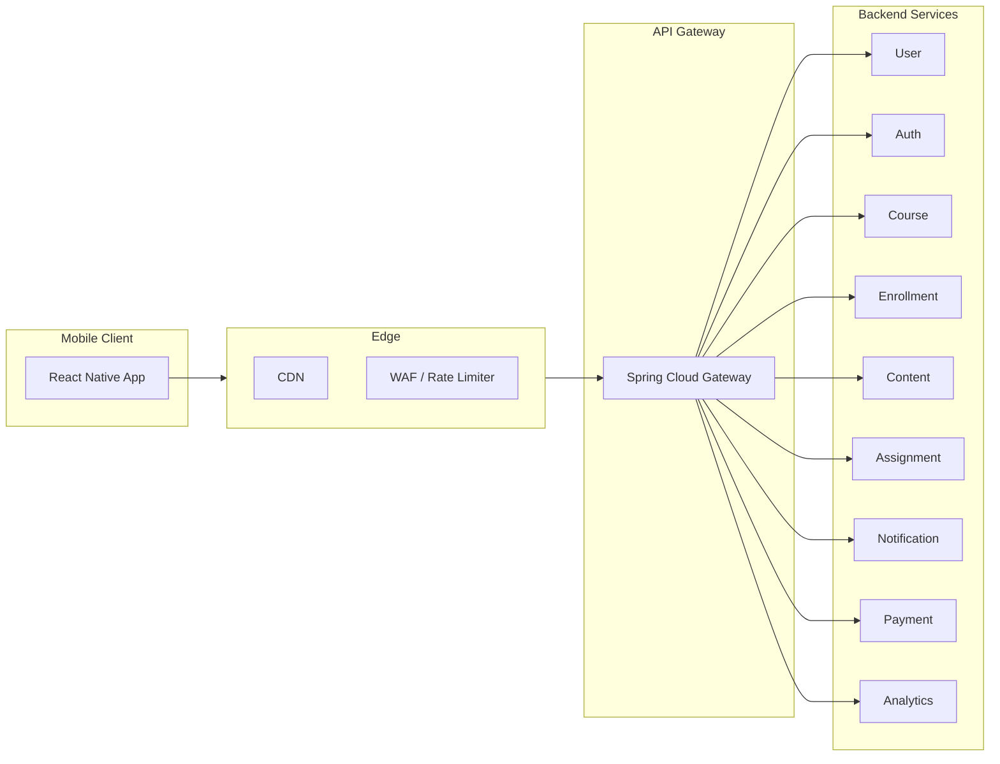
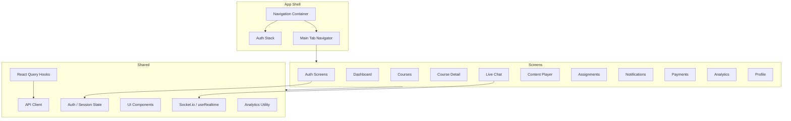

# 1. Mobile Architecture and Platform Integration

## System Context

The LMS mobile app is a **React Native** client running on iOS and Android. It talks only to the **API Gateway** over HTTPS; the gateway routes to backend microservices just like the web frontend.

## App-Level Architecture

At a high level, the app is structured as:

- **Navigation layer**: React Navigation container with an auth stack and a main tab navigator.
- **Screens**: Auth, Dashboard, Courses, CourseDetail, Player, Assignments, Notifications, Payments, Analytics, Profile.
- **Shared components**: Buttons, text, inputs, list items, cards, modals, etc.
- **Data layer**: API client and React Query hooks for all backend calls.
- **Real-time layer**: Socket.io client for live chat, presence, and instant updates.
- **State layer**: Auth/session state and any lightweight UI state.

## Offline & Persistence

- **Caching**: TanStack Query (React Query) manages data fetching and caching.
- **Persistence**: `createAsyncStoragePersister` is used to persist query data for up to 24 hours, enabling basic offline view of previously loaded content.
- **Focus Management**: AppState listeners trigger revalidation when the app returns to the foreground.
- **Background Sync**: `expo-background-fetch` periodically updates unread notification counts and app badges.

## Real-time & Events

- **WebSockets**: Socket.io is used for bidirectional communication (e.g., Live Chat).
- **Push Notifications**: Integrated with Expo Push Notifications for high-priority alerts.

## Alignment with Web Frontend

- Use the **same backend APIs** and domain concepts as the web app.
- Mirror core learner flows: login, browse courses, enroll, consume content, manage assignments, see notifications, make payments (if enabled), and view basic analytics (for instructors/admins).
- Reuse naming conventions and query key patterns where it makes sense to simplify reasoning across platforms.

For backend details, see `[docs/01-architecture.md](../01-architecture.md)` and web frontend architecture in `[docs/frontend/01-frontend-architecture.md](../frontend/01-frontend-architecture.md)`.

