# 1. Mobile Architecture and Platform Integration

## System Context

The LMS mobile app is a **React Native** client running on iOS and Android. It talks only to the **API Gateway** over HTTPS; the gateway routes to backend microservices just like the web frontend.

```mermaid
flowchart LR
    subgraph mobileClient [Mobile Client]
        MobileApp[React Native App]
    end

    subgraph edge [Edge]
        CDN[CDN]
        WAF[WAF / Rate Limiter]
    end

    subgraph gateway [API Gateway]
        GW[Spring Cloud Gateway]
    end

    subgraph backend [Backend Services]
        UserSvc[User]
        AuthSvc[Auth]
        CourseSvc[Course]
        EnrollSvc[Enrollment]
        ContentSvc[Content]
        AssignSvc[Assignment]
        NotifSvc[Notification]
        PaymentSvc[Payment]
        AnalyticsSvc[Analytics]
    end

    MobileApp --> edge --> GW
    GW --> UserSvc
    GW --> AuthSvc
    GW --> CourseSvc
    GW --> EnrollSvc
    GW --> ContentSvc
    GW --> AssignSvc
    GW --> NotifSvc
    GW --> PaymentSvc
    GW --> AnalyticsSvc
```

## App-Level Architecture

At a high level, the app is structured as:

- **Navigation layer**: React Navigation container with an auth stack and a main tab navigator.
- **Screens**: Auth, Dashboard, Courses, CourseDetail, Player, Assignments, Notifications, Payments, Analytics, Profile.
- **Shared components**: Buttons, text, inputs, list items, cards, modals, etc.
- **Data layer**: API client and React Query hooks for all backend calls.
- **State layer**: Auth/session state and any lightweight UI state.

## Offline Scope (Day 1–10)

For the first 10 days:

- **Primary goal**: a reliable **online-first** app with basic caching via React Query.
- Allow React Query to serve **stale data** while revalidating when possible.
- Optionally persist limited query data for key screens (courses, enrollments) using a React Query persister (future enhancement).
- Full offline-first behavior and mutation queuing are out of scope for Day 1–10 and can be documented as later phases.

## Alignment with Web Frontend

- Use the **same backend APIs** and domain concepts as the web app.
- Mirror core learner flows: login, browse courses, enroll, consume content, manage assignments, see notifications, make payments (if enabled), and view basic analytics (for instructors/admins).
- Reuse naming conventions and query key patterns where it makes sense to simplify reasoning across platforms.

For backend details, see `[docs/01-architecture.md](../01-architecture.md)` and web frontend architecture in `[docs/frontend/01-frontend-architecture.md](../frontend/01-frontend-architecture.md)`.

